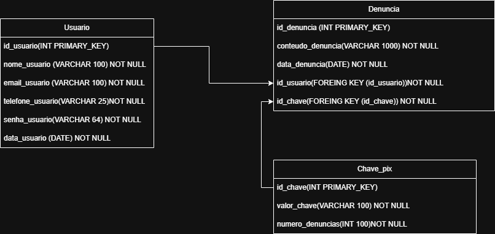

# PIX SHIELD
>Pix Shield é uma plataforma online e gratuita que funciona como central de reclamação de chaves pix com suspeitas de fraude. Nela o usuário pode pesquisar chaves pix, registrar denúncias e ter acesso a estatísticas sobre as mesmas.

### Membros:
* **Gabriel Moraes Martins** ([GitHub](https://github.com/Gdriz20) / [LinkedIn](link))
* **Kleber Tadeu Gobitozzi Filho** ([GitHub](https://github.com/K-Tadeu) / [LinkedIn](https://www.linkedin.com/in/kleber-tadeu))
* **Leonardo do Amaral Quinquio** ([GitHub](https://github.com/leonarddoamaral) / [LinkedIn](https://www.linkedin.com/in/leonardoquinquio))
* **Luighi Cordeiro Gaspareto** ([GitHub](https://github.com/LuighiCordeiro) / [LinkedIn](https://www.linkedin.com/in/luighi-cordeiro-gaspareto-845a9a258))

## Tecnologias Utilizadas

* **Back-end/API:** JavaScript
* **Front-end:** React com TypeScript
* **Banco de Dados:** SQL

## Cronograma e Entregas
 

### Front-end 🖼️🎨

| Data | Tarefa |
| :--- | :--- |
| **🗓️ 29/10** | Início das telas no Figma (Mínimo 3 telas). ✔|
| **🗓️ 05/11** | Todas as telas prontas no Figma + Diagrama de Navegação (Pode ser feito no Draw.io). ✔|
| **🗓️ 12/11** | 80% das telas prontas em REACT. |
| **🗓️ 19/11** | Projeto finalizado com integração com back-end. |

---

### Back-end 📊📟

| Data | Tarefa |
| :--- | :--- |
| **🗓️ 29/10** | Requisitos (RF e RNF), Diagrama de Classes e Diagrama do Banco de Dados. ✔|
| **🗓️ 05/11** | Criação do banco de dados e início do back-end. |
| **🗓️ 12/11** | 80% do back-end finalizado. |
| **🗓️ 19/11** | Projeto finalizado com integração com front-end. |

-----

## Documentação 

### Requisitos Funcionais (RFs)

| RF | Requisitos Funcionais |
|:--- | :--- |
| **RF01** |	O Sistema deve permitir cadastro de novos usuarios. |
| **RF02** |	O Sistema deve permitir ao usuario criar mais de uma denuncia. |
| **RF03** |	O sistema deve permitir a consulta de uma chave PIX por qualquer usuário, sem necessidade de login. |
| **RF04** |	O Sistema deve permitir somente a criação de uma denuncia se o usuario tiver um cadastro. |
| **RF05** |  O usuário deve ter acesso a um histórico com todas as denúncias que registrou. |
| **RF06** |  O Moderador deve ter acesso a um painel para revisar, aprovar (marcar como verificada) ou recusar (marcar como falsa) denúncias pendentes e categorizar o tipo de golpe.
| **RF07** |  A consulta de chave PIX deve retornar o número de denúncias.

### Requisitos Não funcionais (RNFs)

| RNF | Requisitos Não funcionais |
|:--- | :--- |
| **RNF01** | O código deve utilizar as linguagens JavaScript para o back-end, TypeScritpt(utilizando a biblioteca React) para o front-end e SQL para o banco de dados |
| **RNF02** |O sistema deve seguir as heurísticas de Nielsen para garantir uma boa experiência e interface de usuário. |
| **RNF03** | Cada microserviço deve ser isolado e independente. |
| **RNF04** | O Frontend deve fornecer uma interface de usuário clara e responsiva para acesso em dispositivos móveis. |

## Arquitetura e Design

### Diagrama do Banco de Dados

[Visualizar o Diagrama do Banco de Dados na pasta](Docs/Diagramas/DiagramaDataBase.png)

[Visualizar o Diagrama do Banco de Dados Interativo (diagrams.net)](https://viewer.diagrams.net/?tags=%7B%7D&lightbox=1&highlight=0000ff&edit=_blank&layers=1&nav=1&title=Diagrama%20db%20Pix%20Shield.drawio&dark=auto#R%3Cmxfile%3E%3Cdiagram%20name%3D%22Page-1%22%20id%3D%22W171z0s9dX535PrIy8kR%22%3E7Zpbc5s6EIB%2FjWeaB5%2FBYIj96FvStM5l7OQk6UtGBRl0IpAjhC%2F99WcFwoAhidvUdh6Y8YzZ1UrIux8rrXDDGPirc47m3iVzMG3omrNqGMOGruvtUw2%2BpGadaE67nUThcuIkqlammJJfWClVPzciDg4LhoIxKsi8qLRZEGBbFHSIc7Ysms0YLd51jlxcUkxtRMvae%2BIIL9F2TC3Tf8XE9dI7tzTV4qPUWClCDzlsmVMZo4Yx4IyJ5MpfDTCVzkv9kvQ7e6V1MzGOA7FLh1M7QMy0Ft%2BiVt9dPU45%2Fd5tqlEWiEbqB9%2BFEeKEqTmLdeqIcEl8igKQ%2BjMWiKlq0UC2PUKdMVqzSE4kFMh%2BTqW%2Bxzj5BfaIQlMLFNDMhYqzoRUsprKnGpPjEGxu0l%2FX2lJdolXBcIxCkc6GUYrmIfkZz0929BF3SdBnQjBfGS09IvB0jmxpswR05USEn06y7NvUUZgLvMqplK%2FPMfOx4GswUa3NNO4KfN1S8jLDSE8x8nIIbdBHCl13M3YWXbhQAf6NYOulYBPnKUri%2FeXi6hbabiYXl73J49P30eNJCQH45SKOIGfPeMAo46APWMIEoXRLhShxAxApnslu0nUEHqyeUvvEceTI%2FRDCQAJ3HJsN25lmopwiVQy6z2j8%2FHjQEcMI%2FTkjgYidZPbhA24baP%2BYDRPmOgC5lcnwkeZcDFgA00ckDisGaJZYgtPnTCCBfm6Q%2Fm0%2B3ny63odGQWLsyIixL0SMEiIBjJxC0tAtKpL4BAU0rJdIprHEbc0w8VtPuojj2F2pAVy56ruhG93kiiaas2TYxODLv73J4GtvAmNASgUWtatrCejV3Xhcg3lwMHdNXnsDs10CE%2FuI0IxMrSbmUxHTPSAxfLKYPT88R9g3epqlR83m6bRiayMwxA8CulnzMmJ086Sm5Yi0tPQD4jK07B%2B31mN09w158xdM7hlyKnAJceChClasdp1cjo2Leez1yCrh4oBj8svRsHc7qkE5NiidY4PSKYEyxEEU2ATVJfYHS%2By2bhZL7IryybAqgr2h4q9Hu1tVYjubgGt1mb2HrNDZGZzXy%2BxKTvaWFPTyUYwNzyeOHLahpVjP1AXNsaGpKIH3Bs3g%2Bt6PvMnz7exlYWjLjjmfNCuO7%2BItx4aXesPxCSipKHsPnFrKJyW5U96z68no4uoc2mHpketR1nZSqIAPdtBXM3pwRquK7cNC2irvigFE20MLXIlo3HJSJ7djg1NRdh8YHL0Uduy4OC2VwIUec1mA6CjTgveiwMGO8l1mM2Zsrjz2HxZirUomFAlW9CdeEfGQu36UQ0HoEmmY1kmxsE6FAH7vQ17I9ZJi1i2W0n6v1kUhi7iN38r8iR0Ufy5%2BK%2BzpCiEd92bUOaZIkAUuTKMqpKrrjQQ%2BX54V34Aa7S0qkpmqXhkYPc7ROmemnqNX72Ns30cz88O9b2%2BZW1wmM8go3fjkA%2BCW36wNZFJ7mpNVCen6IOBjBwHtql2YUXUQoO8tUVVuw5IVrj4D2MPJoLEzNG8cAlQxsr%2B1zCwhApeMK0rq15mfCpeq8n9fuFS%2BzyyX%2F0HkY54dGIUqsUhcalaOycquy8%2F%2BUkv3mNvkdC%2B8yzb5z7e76Qr77n43LTb%2F3n73ldiAmP2dM9k4Zn%2BKNUb%2FAw%3D%3D%3C%2Fdiagram%3E%3C%2Fmxfile%3E)

### Diagrama De Navegação

[Vizualizar diagrama de navegacão na pasta](/Docs/Diagramas/diagramaNavegação.png)

### Layout Telas (Apenas Design)

[Visualizar pasta com Layouts](Docs/Layouts/)

